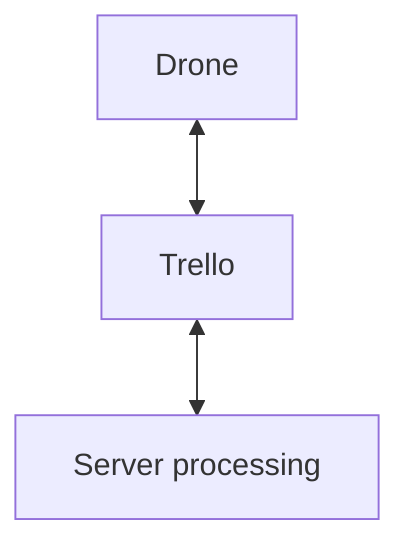

# C++ backend for a player made networking module made in the game: [Plant with coding by Lated Graham](https://www.roblox.com/games/122761763017872/Plant-with-Coding).  

## Features:  
- Plant growth simulation
- Automatic cropping/harvesting
- Automatic planting
- Command-acknowledgement system
- HTTP proxy support

## Requirements:
1. Ingame dependancies:
   - player.
   - market.
   - string.
   - list.
   - task.
   - math.
   - drone.
   - droneV2.
   - http.
2. Server dependancies(already included in in repository):
   - nlohmann::json
   - httplib
## Architecture:
1. Communication:

2. Processing:
   - The drone first iterates through all the seed names available and creates 3 entries in a PlantNum dictionary(hash map): Name, NameTree, NameBush
   - The drone and the scan data decoder uses the "Mixed-Radix Numeral System conversion" formula to encode and decode 5 pieces of important data:
        - Plant number(what plant is on a tile, defaults to 0 for empty entries)
        - Plant percent(defaults to 0)
        - Fruit percent(defaults to 0)
        - Index(ranges from 0-728, calculated using: x+13+(y+13)*27)
        - Time offset(calculated by taking current time and subtracting it with a time header stored when the scanner starts scanning the first tile)
   - At the end of the encoding process, the scanners append the time header and awaits their scan partner(1-2,3-4,5-6,7-8) to finish, then they send it to trello
   - Server stores all scan data then updates the internal map if it has the flag WaitingForScan
   - A map simulator thread will attempt to simulate tiles with the flag Simulated or if there are seeds in the player's inventory, tiles with the flag Empty.If a simulated tile reaches their ready time or if seeds can be planted on a empty tile, the map simulator thread will add a command object with the format {"action",x,y,"optionalSeedName"} and en-queue this tile.If map simulator finishes iterating through all 729 tiles, or if there are 100 command objects, it will add these command objects to a commandQueue.
   - A seperate thread will take items from the commandQueue and create a command card.
   - There is also a clean up thread that removes old command cards by processing drone acknowledgements and also un-queues tiles.
3. Command handling
   - A thread in-game called "droneNetworker" will poll trello continuously for new command cards and attempt to grab them, appending them to the command queue if successful
   - A drone thread will take these commands and execute them, as well as create acknowledgements to inform the server that x command packet has been done.
4. Proxying
   - Drone sends a card with the name being : id host path method awaitResponseFlag
   - Server processes this card, and depending on what state the awaitResponseFlag is, will do: 0.No reply, server never sends a reply card back 1.Body only, server sends only the json body back 2.Full, server sends a card containing headers and a card containing the body.


# Building:  

## Windows:  
```bash
g++ -O2 -std=c++20 -I include -I third_party -I third_party\nlohmann src/*.cpp -o server.exe -DCPPHTTPLIB_OPENSSL_SUPPORT -lws2_32 -lssl -lcrypto -lcrypt32  
```
## Linux:  
```bash
g++ -O2 -std=c++20 -I include -I third_party -I third_party/nlohmann src/*.cpp -o server -DCPPHTTPLIB_OPENSSL_SUPPORT -lssl -lcrypto -lpthread  
```
or using the Dockerfile.If compiled directly on your machine, and you can't inject environment variables directly you will need to hard code the trello api key,token and boardID at lines 86-88 in src/server.cpp.  

Name your environment variables as follows:  
APIKEY  
APITOKEN  
BOARDID

# Limitations:
   - Proxying is very in-progress and much testing has not been done to ensure 100% functionality, also doesn't have a suitiable response to large data being returned
   - Data set is very limited, I kinda forgot to get data so...
