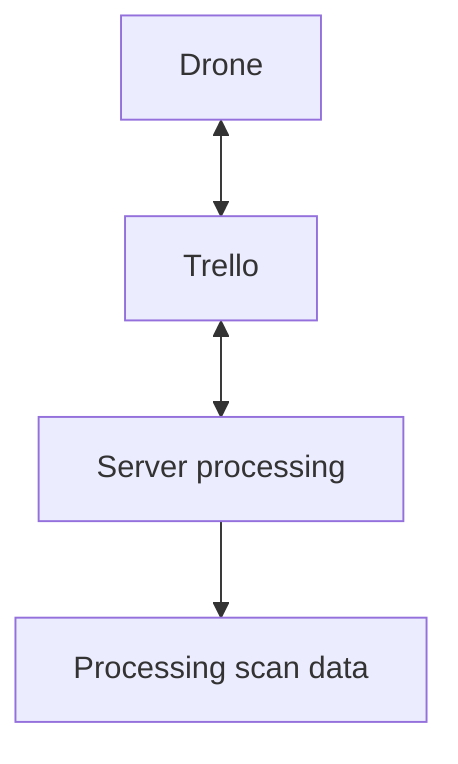

# C++ backend for a player made networking module made in the game: [Plant with coding by Lated Graham](https://www.roblox.com/games/122761763017872/Plant-with-Coding).  

## Features:  
- Plant growth simulation
- Automatic cropping/harvesting
- Automatic planting
- Command-acknowledgement system
- HTTP proxy support

## Requirements:
1. Ingame dependancies:
   - player.
   - market.
   - string.
   - list.
   - task.
   - math.
   - drone.
   - droneV2.
   - http.
2. Server dependancies(already included in in repository):
   - nlohmann::json
   - httplib
## Architecture:

you can compile by doing:  

# Windows:  

g++ -O2 -std=c++20 -I include -I third_party -I third_party\nlohmann src/*.cpp -o server.exe -DCPPHTTPLIB_OPENSSL_SUPPORT -lws2_32 -lssl -lcrypto -lcrypt32  

# Linux:  

g++ -O2 -std=c++20 -I include -I third_party -I third_party/nlohmann src/*.cpp -o server -DCPPHTTPLIB_OPENSSL_SUPPORT -lssl -lcrypto -lpthread  

or using the Dockerfile.If compiled directly on your machine, and you can't inject environment variables directly you will need to hard code the trello api key,token and boardID at lines 86-88 in src/server.cpp.  

Name your environment variables as follows:  
APIKEY  
APITOKEN  
BOARDID
